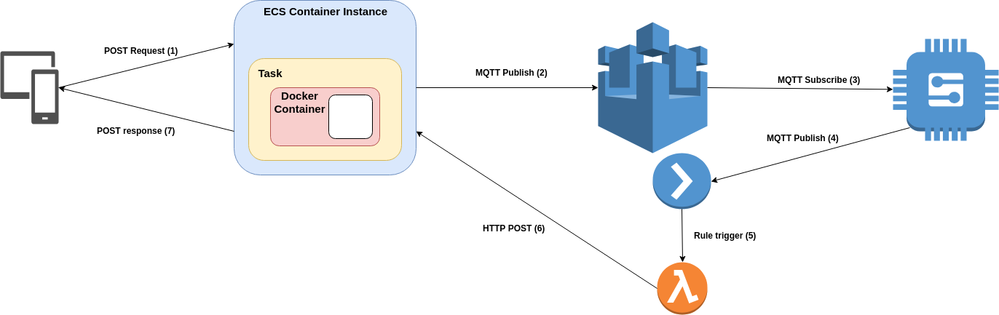

#### This is the documentation for the ECS-IOT-POC.

The API Path is an HTTP proxy passthrough, so every device will have it's own path making it RESTfull:

    POST Request example
    
    www.example.amazon.com/device-request/{device-id}

##### ECS Task
Upload the serverless,yml file to AWS Cloudformation
Which will create a taskdefinition. 

Repositories will also be made:

So make sure you upload your docker image to the correct one.
The xray repository is used for debugging purposes.

Before you can push the your docker image to ECR you got to login:

    aws ecr get-login --no-include-email --region {AWS REGION}

Copy paste the response and login.

To upload your docker image the repositories:

    docker tag {IMAGE NAME} {AWS REPOSITORY LINK}
    docker push {AWS REPOSITORY LINK}

To run the taskdefinition, go to your aws cli and type:

    aws ecs run-task --cluster DevCluster --task-definition Web-Api --region {AWS REGION} --launch-type FARGATE --network-configuration 'awsvpcConfiguration={subnets='{AWS SUBNET}',securityGroups='{AWS SECURITY GROUP}',assignPublicIp='ENABLED'}